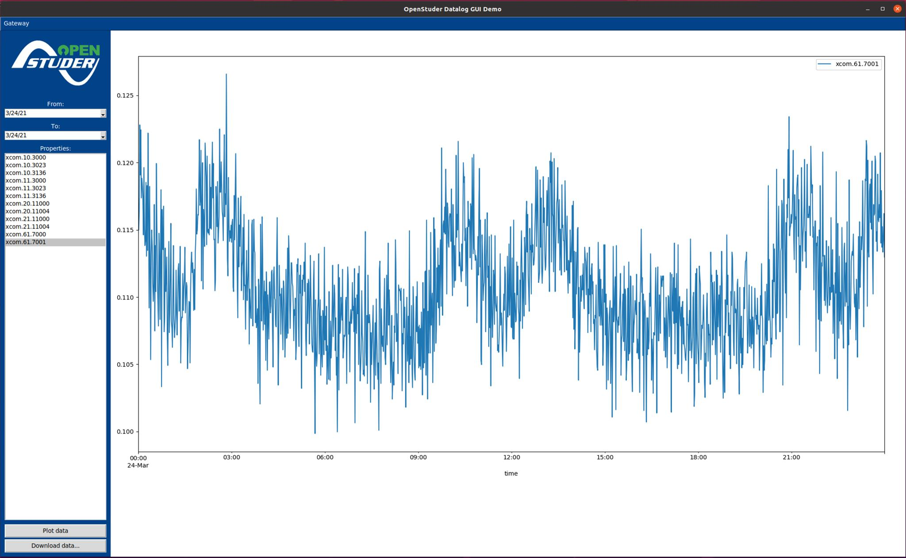

# Python examples for OpenStuder client

The examples have been tested on **Ubuntu 20.04 LTS**, but they should run fine on Windows and macOS or any other Linux distribution too.

However, the instructions how to prepare your system and run the examples are for Linux (Ubuntu), but it should be not very hard to adapt those for your OS.

## Requirements

### Git

You need **git** to clone the projects to your local machine.

	# sudo apt install git

### Python 3.7+, pip, virtualenv and Tk bindings for Python (tkinter)

	# sudo apt install python3 python3-pip python3-tk
	# sudo pip3 install virtualenv

## cli

Simple interactive shell to demonstrate the use if the **synchronous** client. We recommend to start with this example if you are new to OpenStuder as this is by far the simplest example.

All the code is in **sicli**, to run the example do:

	# git clone https://github.com/OpenStuder/openstuder-examples-python.git
	# cd openstuder-examples-python/cli
	# virtualenv venv
	# source venv/bin/activate
	# pip install -r requirements.txt
	# chmod +x sicli
	# ./sicli -h

## datalog-gui  

Simple GUI application to plot or download logged property values from an OpenStuder gateway. *tkinter* based. This example demonstrates the use of the **synchronous** client.

Tested to work on Ubuntu Linux and macOS, whereby it looks terrible on macOS Big Sur due to incompatibilities of tkinter with the new look and feel of macOS.

All the code is in **main.py**, to run the example do:

	# git clone https://github.com/OpenStuder/openstuder-examples-python.git
	# cd openstuder-examples-python/datalog-gui
	# virtualenv venv
	# source venv/bin/activate
	# pip install -r requirements.txt
	# python main.py
